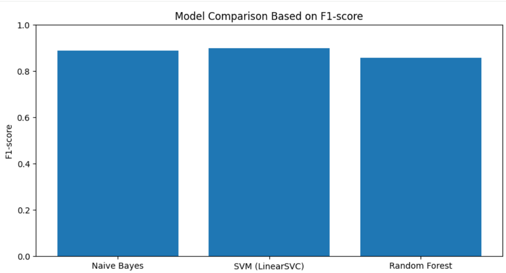

## Fake Review Detection using Machine Learning (Shopee Dataset)

## Overview
Online reviews play a critical role in influencing customer decisions in e-commerce platforms. However, the presence of fake reviews can mislead consumers and reduce trust in online marketplaces.

This project focuses on detecting fake reviews on Shopee using machine learning techniques applied to a multilingual dataset (English, Malay, Indonesian).

---

## Objectives
- Detect fake vs genuine reviews using machine learning
- Compare multiple models to identify the best-performing classifier
- Analyze model performance using evaluation metrics

---

## Dataset

## Dataset
- Source: Public Shopee dataset (GitHub)  
- Link: https://github.com/andrioktavianto/fake-review-shopee/blob/master/train_review_only.csv  
- Multilingual reviews (English, Malay, Indonesian)
- Labels:
  - `1` → Fake Review  
  - `0` → Genuine Review  

The dataset includes real-world user-generated reviews with mixed languages and informal expressions, making it suitable for practical ML applications.

---

##  Methodology

### 1. Data Preprocessing
- Removed missing values
- Text cleaning:
  - Lowercasing
  - Removal of URLs, punctuation, numbers
- Label encoding (Fake = 1, Real = 0)

---

### 2. Feature Engineering
- TF-IDF Vectorization
- Unigrams + Bigrams
- Converted text into numerical feature matrix

---

### 3. Model Training
The following models were implemented:
- Naive Bayes (NB)
- Support Vector Machine (SVM)
- Random Forest (RF)

- Train/Test Split: 80/20
- Stratified sampling applied

---

### 4. Model Evaluation
Evaluation metrics used:
- Accuracy
- Precision
- Recall
- F1-Score
- Confusion Matrix

---

## 📈 Results

| Model            | Performance |
|------------------|------------|
| Naive Bayes      | Moderate   |
| Random Forest    | Good       |
|  SVM             | **Best**   |

### Key Finding:
**Support Vector Machine (SVM) achieved the best performance**, providing the most balanced results across accuracy, precision, recall, and F1-score.

---

## Visual Results

### Model Comparison

### Confusion Matrices
- SVM  

- Naive Bayes  

- Random Forest  

---

## Key Insights
- Traditional ML models are still highly effective for text classification
- SVM performs well with high-dimensional TF-IDF features
- Fake review detection works effectively even on multilingual datasets
- Language diversity does not significantly reduce model performance

---

## Future Improvements
- Implement deep learning models (BERT, LSTM)
- Expand dataset size for better generalization
- Include sentiment + behavioral features
- Deploy as a real-time web application

---

## Tech Stack
- Python
- Scikit-learn
- Pandas, NumPy
- Matplotlib / Seaborn
- Jupyter Notebook

---

---

##  Author
**Najwatul Intan Tasnim Binti Mohd Anafi**  
Bachelor of Information Technology (Data Science)  
Universiti Malaysia Kelantan  

---

##  Project Impact
This project contributes to improving **trust and transparency in e-commerce platforms** by identifying deceptive reviews using machine learning.

It can support:
- Consumers → better decision making  
- Sellers → protection from unfair competition  
- Platforms → improved review authenticity  

---

 If you find this project useful, feel free to explore or connect!
